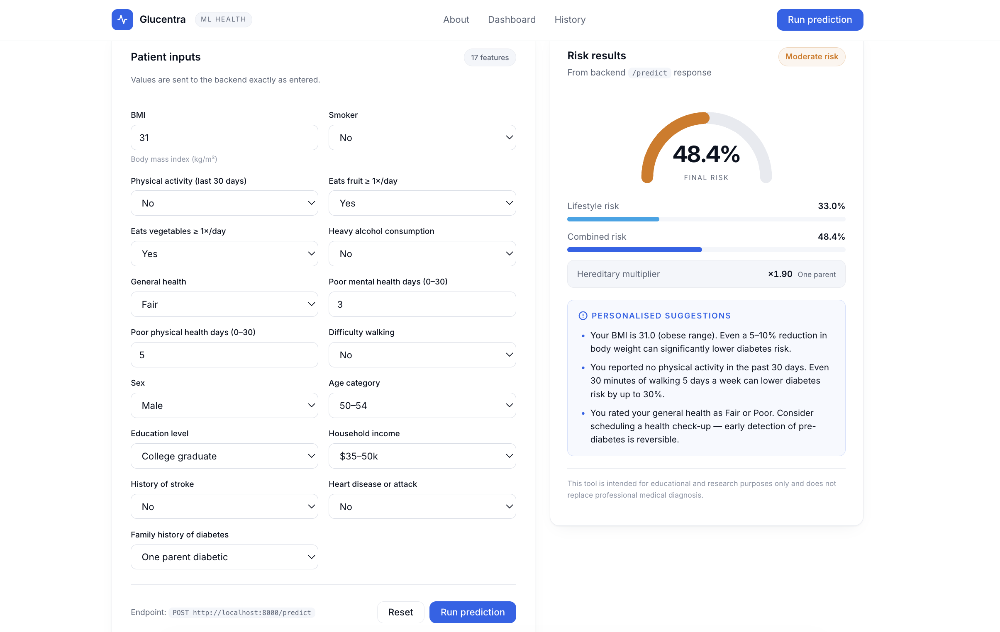
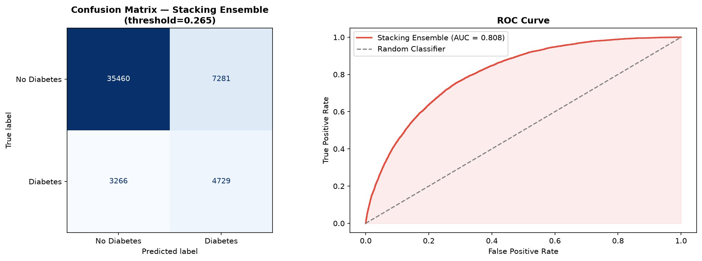
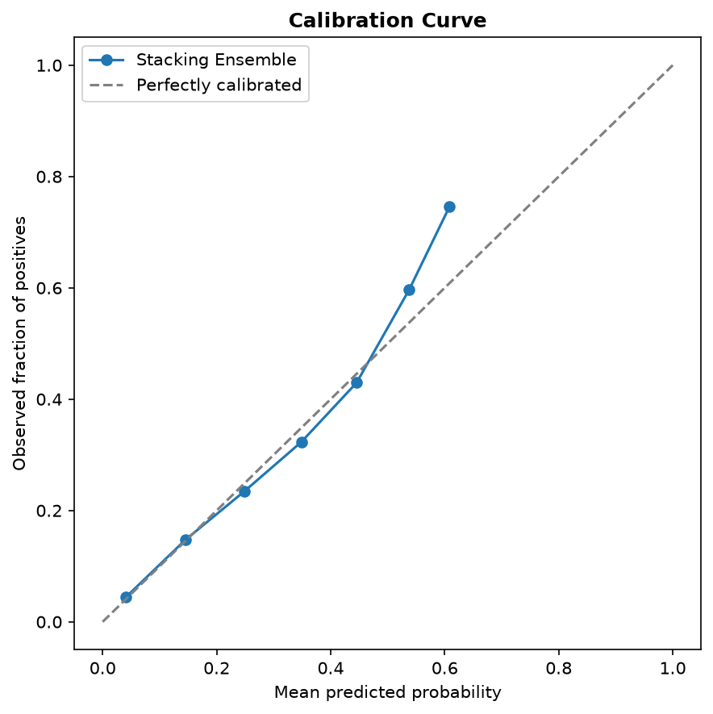

# Glucentra: Diabetes Risk Prediction from Non-Clinical Indicators

Estimates **diabetes / prediabetes risk** from lifestyle and demographic inputs, then adjusts it
for family history using literature-based relative-risk multipliers.
No blood test or clinic visit needed.



## Why this design

- **Non-clinical features only.** `HighBP`, `HighChol` and `CholCheck` are dropped because they
  need a prior doctor visit, which defeats the purpose of a pre-screening tool.
- **Family history is applied at inference, not trained.** BRFSS has no family-history column.
  Inventing synthetic values would teach the model noise, so family history is applied afterwards
  as an odds multiplier (`odds x relative risk -> probability`), which keeps results inside 0-1.
- **Engineered features.** `Metabolic_Risk` (BMI x GenHlth), `Age_BMI` and `Lifestyle_Burden`.
  The first two rank in the top three XGBoost feature importances.

## Architecture

```
Form (HTML/JS) -> FastAPI /predict -> Stacking model (XGBoost + LightGBM + RF -> LR)
               -> odds x hereditary multiplier -> risk % + suggestions
```

## Results

Data: 253,680 records, 15.8% positive (diabetes or prediabetes). Stratified 80/20 split
(202,944 train / 50,736 test).

| Model                 | CV AUC (5-fold) | Test AUC |
| --------------------- | --------------- | -------- |
| Logistic Regression   | 0.8027          | 0.8020   |
| Random Forest         | 0.8075          | 0.8057   |
| XGBoost               | 0.8079          | 0.8075   |
| LightGBM              | 0.8066          | 0.8068   |
| **Stacking Ensemble** | n/a (internal)  | 0.8076   |

All models land at AUC around 0.80-0.81. Stacking does not meaningfully beat the single models,
which suggests the lifestyle inputs, not model complexity, are the ceiling. Stacking's probabilities are well calibrated in the low-to-mid range (see below).

**Stacking at the F1-optimal threshold (0.265):**

| Metric    | Value          |
| --------- | -------------- |
| Accuracy  | 79.21%         |
| Precision | 0.394          |
| Recall    | 0.592          |
| F1        | 0.473          |
| TP / FN   | 4,729 / 3,266  |
| FP / TN   | 7,281 / 35,460 |

Accuracy is misleading on imbalanced data: always predicting "no diabetes" scores 84.2%.
That is why AUC, recall and F1 are reported. For a pre-screening tool a false alarm leads to a
blood test, while a miss leads to nothing, so recall is favoured over precision.



**Calibration.** The lifestyle-risk probabilities track observed frequencies closely up to a
predicted risk of about 45% (predicted 25% -> observed ~23%). Above that the model slightly
underestimates risk (predicted ~61% -> observed ~75%), and it rarely predicts above 60%.
The hereditary multiplier is applied on top and is not itself validated.



Feature importances (XGBoost) are in `docs/feature_importance.png`.

## Quickstart

Built with **Python 3.14**. Dependency versions are pinned in `requirements.txt`.

```bash
git clone https://github.com/VEDANg04/glucentra-diabetes-risk.git && cd glucentra-diabetes-risk
python3 -m venv .venv && source .venv/bin/activate
pip install -r requirements.txt
brew install libomp            # macOS only, needed by LightGBM/XGBoost

# put the CSV in data/ (see data/README.md), then:
python backend/model_train.py       # a few minutes, saves models/diabetes_model.pkl
python backend/model_evaluate.py    # saves plots to docs/
pytest -v                           # 5 tests

# run the app (two terminals)
cd backend && uvicorn api:app --reload --port 8000
cd frontend && python3 -m http.server 5500     # open http://localhost:5500
```

## API example

```bash
curl -X POST http://localhost:8000/predict -H "Content-Type: application/json" -d '{
  "BMI": 30, "Smoker": 0, "Stroke": 0, "HeartDiseaseorAttack": 0, "PhysActivity": 1,
  "Fruits": 1, "Veggies": 1, "HvyAlcoholConsump": 0, "GenHlth": 3, "MentHlth": 2,
  "PhysHlth": 2, "DiffWalk": 0, "Sex": 0, "Age": 8, "Education": 5, "Income": 6,
  "FamilyHistory": "one_parent"}'
```

Response:

```json
{
  "lifestyle_risk": 20.8,
  "combined_risk": 33.3,
  "final_risk": 33.3,
  "risk_label": "Moderate",
  "risk_level": 2,
  "hereditary_mult": 1.9,
  "hereditary_label": "One parent",
  "suggestions": [
    "Your BMI is 30.0 (obese range). Even a 5-10% reduction in body weight can significantly lower diabetes risk."
  ]
}
```

## Limitations

- BRFSS is self-reported, US-only survey data and may not generalise to other populations.
- The target merges prediabetes and diabetes.
- At the chosen threshold, 3,266 of 7,995 positive test cases are still missed, and about 6 in 10 flags are false alarms.
- Calibration is good in the low-to-mid range but under-predicts for the highest-risk profiles.
- Literature relative risks are applied as odds multipliers, which is an approximation. The family-history
  adjustment is not validated against real labels and may partly double-count with correlated lifestyle features.
- Risk bands (25% / 50%) are illustrative display cutoffs, not clinical thresholds, and are separate
  from the F1-optimal threshold used in evaluation.

## Security notes

- `joblib.load` can execute arbitrary code. Never load a `.pkl` file from an untrusted source.
- CORS is restricted to local dev origins (port 5500). Update it before deploying.

## Future work

Isotonic/Platt calibration, SHAP explanations, validation on a dataset that includes family history,
deployment with a live demo.

## Disclaimer

For educational and research use only. Not a medical diagnosis.

Built by Vedang Kimmatkar.
